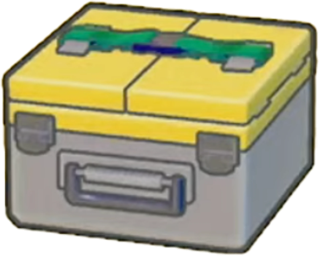

  

<h1 align="center">workbench-kit</h1>

  <em>어디서 시작할지도 모르겠고, 매번 레포 새로 파고 AGENTS.md 쓰는 것도 지친 메타몽들의 작업대.</em>

  <a href="README.md">English</a> ·
  <a href="README.ko.md">한국어</a>

  
  
  
  

---

뭐든 될 수 있어서, 매번 아무것도 아닌 채로 시작한다.

아이디어가 하나 떠오르면 또 레포를 판다. AGENTS.md를 또 쓴다. 폴더 구조를 또
잡는다. 정작 하고 싶던 일에 닿기도 전에 기운이 다 빠진다. 메타몽은 뭐든 될 수
있지만, 정작 제 모양은 없으니까.

workbench-kit은 그런 메타몽한테 작업대를 하나 내준다. 매번 새로 차릴 필요 없는,
이미 차려진 자리.

## 여기선 이렇게 된다

뭐든 하나 가져와서 일하면 된다. 작업마다 마음껏 어질러도 되는 제 자리가 생기고,
일이 끝나면 남길 만한 한 조각 — 결정이든 교훈이든 고친 것이든 — 만 챙겨두고
나머지는 치워진다. 그래서 시간이 지나도 main은 깨끗하고, 쓸 만한 것만 쌓인다.

고정인 부분은 작업대가 알아서 갖고, 네 규칙(이름 짓는 법, 템플릿)과 쌓이는
지식은 네가 채운다. 매번 처음부터 짤 필요가 없다는 뜻이다.

새 레포가 필요해? 그것도 그냥 작업대에 올리는 또 하나의 일이다. 더는 맨바닥부터
시작하지 않아도 된다.

## 상태

🚧 아직 작업대를 짜는 중이다. 뭐가 고정이고 뭐를 네가 채울지부터 정리하고
있어서, 구조는 바뀔 수 있다.

## 라이선스

[MIT](LICENSE).
