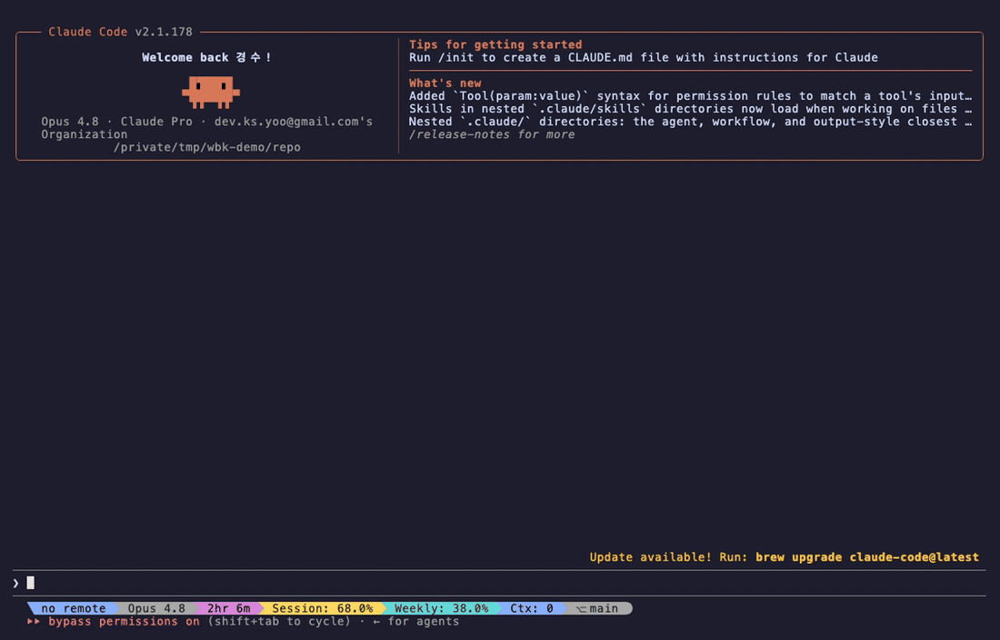
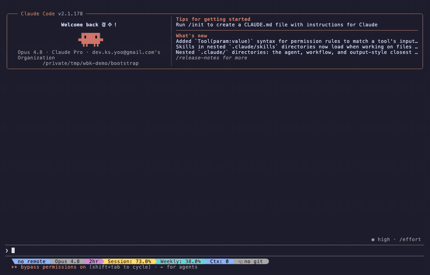

<p align="center">
  
</p>

<h1 align="center">workbench-kit</h1>

<p align="center">
  <em>A bench for shapeshifters tired of spinning up one more repo and one more AGENTS.md.</em>
</p>

<p align="center">
  <a href="README.md">English</a> ·
  <a href="README.ko.md">한국어</a>
</p>

<p align="center">
  
  <a href="LICENSE"></a>
  
  
</p>

---

Every new idea, another repo. Another AGENTS.md. Stuck on where to even start —
because a shapeshifter can be anything, so it starts as nothing, every time.

Hand that setup to the bench. Bring anything and just work; when it's done, the
one piece worth keeping stays and the rest is swept out. Need a new repo? Just
one more thing on the bench.

> 🚧 **Early stage.** The framework runs, but APIs and docs are still settling.
> Expect rough edges and read the [known gaps](#status--known-gaps).

<p align="center">
  
  <br/>
  <em>A real Claude Code agent driving the task lifecycle via <code>/workbench:task-start</code> (offline demo).</em>
</p>

## What you get

workbench-kit is a **marketplace** of two plugins that work together. Install both.

| Plugin | Role | You use it to… |
|---|---|---|
| **`workbench`** | **Engine.** Worktree/task isolation, incremental knowledge harvest, and a skill-driven task lifecycle. | run day-to-day work: start a task, submit it, harvest what's worth keeping. |
| **`workbench-kit`** | **Bootstrap.** Interviews you for your conventions, then generates a minimal personalized workbench repo. | set up a *new* workbench once, tuned to your taste. |

It's **tool-neutral**: the same `skills/` source installs on both Claude Code and
Codex. "Bring your own rules" — the mechanism is fixed, your conventions are not.

## Install

**Claude Code**

```
/plugin marketplace add YOOGOMJA/workbench-kit
/plugin install workbench@workbench-kit
/plugin install workbench-kit@workbench-kit
```

**Codex**

```
codex plugin marketplace add https://github.com/YOOGOMJA/workbench-kit
codex plugin add workbench
codex plugin add workbench-kit
```

Requirements: Claude Code **or** Codex, `git` (with worktree support), and the
`gh` CLI for issue/PR plumbing.

## Quickstart

**1. Create your workbench (once).** The bootstrap plugin runs a short interview,
then scaffolds a minimal repo personalized to your conventions:

```
/workbench-kit:interview-for-personalizing   # draws out your persona
/workbench-kit:generate-workbench            # scaffolds the repo, then discards the draft
```

<p align="center">
  
</p>

What it produces is **minimal by design** — only your stuff. The engine
(skills, `utils/`, `bin/`) stays in the installed plugin, never copied in:

```
my-workbench/
├── AGENTS.md          # composed: framework core + your persona (don't edit directly)
├── CLAUDE.md          # same content (Claude Code reads it); regenerated on recompose
├── AGENTS.overlay.md  # your rules — edit here, then recompose
├── codebases.yaml     # your target repos
├── docs/              # knowledge wiki, starts empty, fills as you work
│   ├── decisions/  lessons/  runbooks/   # anchor tables ("did we already decide?")
│   └── index.md  log.md
├── templates/         # harvest entry + task-AGENTS formats (yours to tune)
├── .github/           # issue (4-element) + PR templates
└── .claude/settings.json  # enables the workbench engine plugin on trust (no manual install)
```

When you open the generated repo in Claude Code and trust the folder, it registers the
marketplace and enables the `workbench` engine plugin automatically. (Codex: add the
marketplace once — see Install.)

**2. Work, from inside your new workbench.** The engine plugin drives the task
lifecycle — each task lives on its own branch and worktree, and only the refined
increment survives to `main`:

```
/workbench:task-start <issue>     # branch + worktree + task/ workspace
# … do the work …
/workbench:task-submit            # clean up task/, open a squash PR
/workbench:task-done <issue>      # sweep the workspace after merge
```

Other entry points: `/workbench:ticket-incubate` (idea → issue),
`/workbench:task-status` · `/workbench:task-tickets` (read-only overviews),
and the `docs-query` · `docs-ingest` · `docs-lint` skills for the knowledge wiki.

## How it works

- **Work is disposable, knowledge accumulates.** Everything happens on a task
  branch; at the end `task/` is cleaned up and the branch is **squash-merged**, so
  `main` keeps one refined increment. The exploration is swept out.
- **Two layers.** *Judgment* (what to extract, the prose) is the agent's; *plumbing*
  (git state transitions) is `utils/`'s. The agent's entry point is always a skill.
- **`AGENTS.core` + `AGENTS.overlay` → `AGENTS.md`.** The framework core is fixed and
  English (upgrades overwrite it). Your persona — language, slug style, issue/PR
  shape, labels, gates — lives in the overlay. The bootstrap composes the two.

Background and design rationale live in
[`framework-docs/workbench-knowledge-ecosystem.md`](framework-docs/workbench-knowledge-ecosystem.md);
the design decisions themselves are recorded as ADRs under
[`framework-docs/decisions/`](framework-docs/decisions/).

## Repo layout

```
plugins/
  workbench/        engine — skills, utils/, bin/workbench, tests/
  workbench-kit/    bootstrap — interview + generate-workbench skills, and
                    scaffold/ (incl. AGENTS.core.md) it lays into a user repo
framework-docs/     design decisions, lessons, runbooks, synthesis
scripts/            release tooling (bump / version-sync / release)
tests/              frontmatter, install-model, CI checks
AGENTS.md           repo/dev guide (for working ON the kit)
```

scaffold lives **inside** the bootstrap plugin so a marketplace install ships it;
the engine reads it via `${CLAUDE_PLUGIN_ROOT}`.

## Status & known gaps

- **Early stage**, first release (`0.1.0`) in progress. See [CHANGELOG.md](CHANGELOG.md).
- **Translation in progress.** Framework-facing content (this README, `AGENTS.core`,
  scaffold, bootstrap skills) and all skill *descriptions* are English. The engine
  skill *bodies* and `framework-docs/` are still Korean, being translated incrementally.

## Docs

- [CHANGELOG.md](CHANGELOG.md) — what changed, release by release
- [RELEASING.md](RELEASING.md) — how a release is cut (maintainers)
- [framework-docs/](framework-docs/) — design decisions, lessons, runbooks

## Contributing

PRs welcome. Every change that affects behavior adds a line under `## [Unreleased]`
in [CHANGELOG.md](CHANGELOG.md). CI runs frontmatter lint, manifest parse, version
sync, ShellCheck, and lifecycle/compose smoke tests — see
[`.github/workflows/ci.yml`](.github/workflows/ci.yml).

## License

[MIT](LICENSE).
