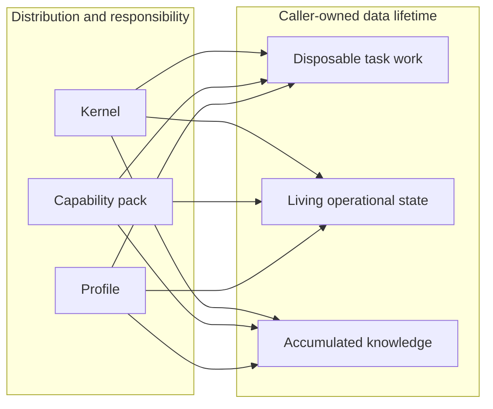
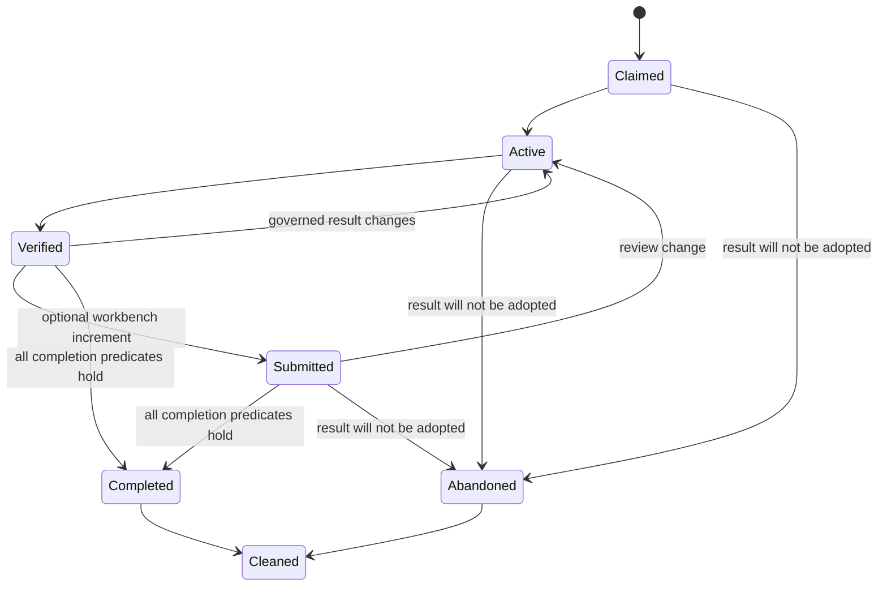
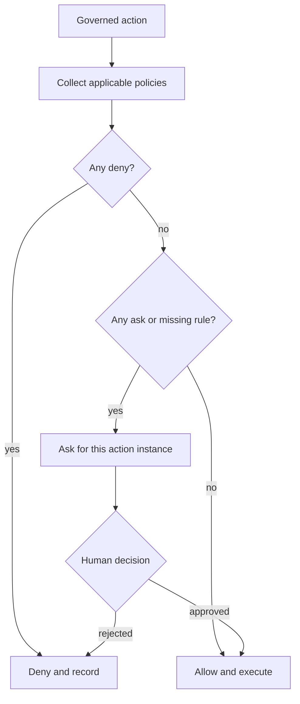
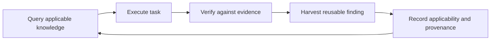
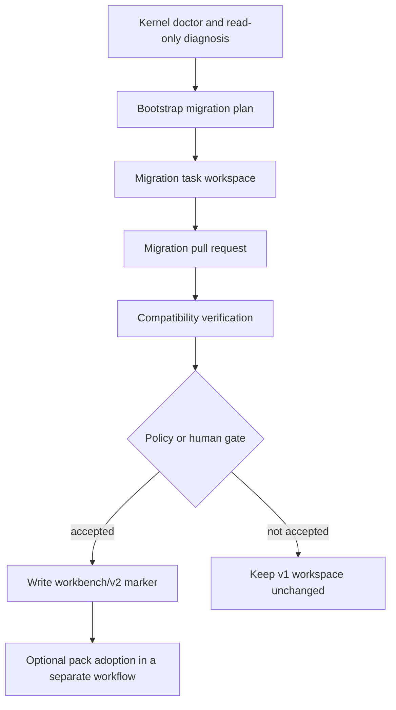

# Workbench v2 Governance Contract

Status: accepted design contract for workbench v2. Implementation is tracked by
[workbench-kit #26](https://github.com/YOOGOMJA/workbench-kit/issues/26) and migration by
[workbench-kit #27](https://github.com/YOOGOMJA/workbench-kit/issues/27). A consumer must
probe the running engine; this document alone does not imply that a capability is installed.

This document is normative for the public boundary shared by the workbench kernel,
bootstrap and migration tooling, and optional capability packs. Product, portfolio, and
scenario semantics remain outside the kernel.

## Design goals

1. Keep the generated workbench model: each issue executes in an isolated task workspace,
   durable results land in their owning repositories, selected knowledge is accumulated,
   and disposable task state is cleaned afterward.
2. Let one task deliver changes to zero or more codebases without requiring an empty
   workbench pull request.
3. Evaluate standing authorization deterministically without turning every gate into a
   prompt or removing the gate.
4. Give optional packs a stable public API and compatibility probe instead of prose parsing,
   internal imports, or implicit hooks.
5. Preserve v1 tasks and lifecycle observations while migration occurs incrementally.
6. Support compound engineering without mixing current product intent into reusable
   workbench knowledge.

## Canonical vocabulary

The following English identifiers are stable across tools and output languages.

| Term | Meaning |
|---|---|
| kernel | The generic `workbench` engine, public CLI, lifecycle, and invariants |
| capability pack | An optional plugin that composes public kernel contracts for a domain |
| profile | Caller-owned policy values, conventions, language, and document formats |
| task | One independently governed execution unit, rooted in one issue |
| deliverable | A declared result owned by a repository or another explicit target |
| evidence | A check result bound to an immutable revision |
| living state | Mutable intent that directs later work and survives task cleanup |
| knowledge | Reusable decisions, lessons, and runbooks accumulated across tasks |
| completion | Acceptance of every required outcome under current evidence and policy |
| abandonment | A terminal decision not to adopt the task's intended result |
| cleanup | Removal of task workspaces and local branches after a terminal outcome |

Translations may be shown to a person, but stored keys, schema IDs, lifecycle values,
capability IDs, and command names stay in English.

## Two independent axes

The v1 `framework / profile / knowledge` model mixed responsibility with data lifetime.
V2 makes those dimensions explicit and independent.



The responsibility axis answers who ships a rule and who interprets it. The lifetime axis
answers how caller-owned data evolves:

- **Disposable task work** includes plans, research, status, logs, temporary codebase
  worktrees, and execution evidence that is not itself a durable product artifact.
- **Living state** includes current intent, priorities, scenarios, quality constraints, and
  authorization scoped to a workspace or domain. It is edited over time, not harvested as
  an immutable lesson.
- **Accumulated knowledge** includes reusable decisions, failed approaches, and runbooks.
  It is queried by later tasks and is not a backlog or current product status store.

Plugin bundles contain executable framework content only. They never own caller runtime
state in any lifetime category.

## Task contract

### Identity and generic references

Existing task identity remains rooted in the issue and recorded in `task/index.md`.
V2 adds two optional, opaque references:

- `context_ref`: the longer-lived context under which the task is governed.
- `work_ref`: the work item that the task advances.

The shared syntax is:

```text
<namespace>:<kind>/<id>
```

`namespace` and `kind` match `[a-z][a-z0-9-]*`. `id` is one or more ASCII letters,
digits, dots, underscores, or hyphens. Examples are `toolbox:product/acme` and
`toolbox:scenario/SCN-001`. The kernel validates syntax, stores the exact value, detects
duplicate active `work_ref` values, and reports the references. Only the namespace owner
interprets the value. Missing references have no product meaning and remain valid.

### Deliverables

A task declares zero or more deliverables. Each deliverable has, at minimum:

| Field | Contract |
|---|---|
| `deliverable_id` | Stable and unique within the task |
| `owner` | Registered repository or explicit owning target |
| `kind` | Kernel-defined kind or a namespaced pack kind |
| `required` | Boolean; defaults to `true` |
| `external_ref` | Optional pull request, artifact, or other delivery reference |
| `revision` | Immutable revision accepted or currently under verification |
| `state` | `declared`, `submitted`, `accepted`, `waived`, or `rejected` |

The kernel understands the mechanics of its own kinds, such as a codebase pull request or
a workbench increment. It does not infer product semantics from a deliverable. A required
deliverable can be `waived` only through a governed action with a recorded reason. An open
or unmerged pull request is `submitted`, not `accepted`. A task with no workbench increment
must not create an empty workbench pull request merely to reach completion.

### Verification evidence

Evidence is an observation, not a claim inferred from prose. The public
`workbench-evidence/v1` record uses these fields:

| Field | Contract |
|---|---|
| `evidence_id` | Stable and unique within the task |
| `deliverable_id` | Optional related deliverable |
| `owner` | Registered repository or explicit target |
| `revision` | Immutable revision checked |
| `check_id` | Stable identifier for the required check |
| `command` | Optional exact local command |
| `result` | `passed` or `failed` |
| `recorded_at` | RFC 3339 timestamp |
| `source` | `local` or `ci` |
| `url` | Optional independently inspectable remote evidence |

Evidence is current only when its revision equals the revision being accepted. A new commit,
changed artifact digest, or changed required check set makes older evidence stale. A summary
such as "tests passed" without a revision cannot satisfy completion.

### Lifecycle facts

Lifecycle comments remain append-only, centrally observable facts. They are neither locks
nor the sole source of truth. Current state is derived by joining task metadata, branches,
deliverables, pull requests, evidence, policies, issue state, and lifecycle observations.



The v2 marker ID is `workbench-task-lifecycle:v2`. It adds the facts
`task-verified`, `task-completed`, and `task-abandoned` to the existing claim, active,
submitted, conflict, and cleaned family. A writer correlates events with the task's
`claim_id` and branch. Marker details remain machine facts; issue disposition, labels,
and explanatory prose remain outside the marker.

V2 retains the v1 marker fields exactly: `event`, `claim_id`, `issue`, `home`, `branch`,
`pr`, `actor`, `tool`, and `at`. Detailed deliverable, evidence, and policy facts remain
available through their public CLI records rather than being duplicated into a lifecycle
comment. This lets v1 parsers ignore a v2 marker without teaching lifecycle comments to be
a state database.

The meanings are distinct:

- `task-verified` says the required checks passed for named revisions at that time. It can
  become stale and the task can return to active work.
- `task-submitted` says a workbench increment pull request exists. It is optional and is not
  completion.
- `task-completed` is a terminal adoption outcome. Later external rollback is a new fact or
  task; history is not rewritten.
- `task-abandoned` is a terminal non-adoption outcome. It is not completion or failure
  disguised as cleanup.
- `task-cleaned` says local task resources were removed after a terminal outcome. It says
  nothing about whether the outcome was completion or abandonment.

### Completion predicate

A v2 task is complete only when all applicable conditions hold:

1. Every required deliverable is `accepted` or has a policy-authorized `waived` outcome.
2. Every required verification check has passing, current evidence for the accepted
   revision. No failed required check remains current.
3. A declared codebase pull request is merged or otherwise accepted by its owning target;
   merely opening the pull request is insufficient.
4. If the task contains a workbench increment, its normal submit and acceptance path is
   satisfied. If it contains none, no workbench pull request is required.
5. Harvest candidates have a recorded disposition. Product-specific current state is not
   mislabeled as workbench knowledge to satisfy this condition.
6. No applicable policy resolves to `deny`, and no required action remains unresolved at
   `ask`.

Cleanup is never a completion predicate. Destructive cleanup before completion or
abandonment is invalid for v2 tasks. Existing v1 force-cleanup behavior remains a legacy
compatibility path until migration policy removes it in a future major contract.

## Policy contract

Every externally consequential or irreversible action has a stable action ID and must be
resolved before execution. The canonical decisions are:

| Decision | Meaning |
|---|---|
| `allow` | Standing authorization permits this action instance |
| `ask` | Explicit human authorization is required before execution |
| `deny` | Execution is prohibited; the agent must find a non-prohibited alternative or stop |

Policy resolution uses the safety lattice `deny > ask > allow`. Applicable layers are
evaluated in this order of authority:

1. platform and harness safety policy;
2. workspace policy;
3. referenced-context or capability-pack policy;
4. task-local constraints.

A lower-authority layer may tighten but never relax a higher-authority result. A missing
rule and an unknown action ID both resolve to `ask`. An agent must not infer authorization
from previous similar actions, prose, silence, or a successful dry run.



Human approval resolves that action instance; it does not silently rewrite standing
policy. Policy evaluation records the action ID, applicable policy sources, result, and
authorization reference without asking shell plumbing to invent explanatory prose.

The public `workbench-policy/v1` resolution object is:

```json
{
  "contract_version": "workbench-policy/v1",
  "action_id": "task.complete",
  "decision": "ask",
  "sources": [
    {
      "layer": "workspace",
      "ref": "workspace:policy/default",
      "decision": "ask"
    }
  ],
  "authorization_ref": null
}
```

`sources[].layer` is one of `platform`, `workspace`, `context`, or `task`; `ref` identifies
the policy source without requiring prose interpretation. `authorization_ref` is absent or
null until an explicit authorization is recorded for that action instance. Storage file
names are not part of the public contract; consumers use the CLI object rather than reading
engine-private files.

## Public capability discovery

Capability packs must not parse `AGENTS.md`, inspect plugin internals, or guess compatibility
from a package version. They call this read-only command before mutation:

```text
workbench contract show --format json
```

Stdout is exactly one JSON document with `contract_version` equal to
`workbench-contract/v1`. Diagnostics go to stderr. Running outside a workbench, reading an
invalid schema marker, or requesting an unsupported format exits nonzero and emits no
partial JSON.

The canonical v1 shape is:

```json
{
  "contract_version": "workbench-contract/v1",
  "engine": {
    "name": "workbench",
    "version": "0.2.0"
  },
  "workspace": {
    "root": "/absolute/caller/workbench",
    "schema": "workbench/v2",
    "source": "marker"
  },
  "supported": {
    "workspace_schemas": {
      "read": ["workbench/v1", "workbench/v2"],
      "write": ["workbench/v2"]
    },
    "lifecycle_markers": {
      "read": ["workbench-task-lifecycle:v1", "workbench-task-lifecycle:v2"],
      "write": ["workbench-task-lifecycle:v2"]
    },
    "policy_contracts": ["workbench-policy/v1"],
    "evidence_contracts": ["workbench-evidence/v1"],
    "capability_pack_contracts": ["workbench-capability-pack/v1"]
  },
  "capabilities": [
    "workspace.schema/v1",
    "task.refs/v1",
    "task.deliverables/v1",
    "task.lifecycle/v2",
    "task.evidence/v1",
    "task.completion/v1",
    "policy.resolve/v1"
  ]
}
```

`workspace.root` is the absolute caller workbench root. `workspace.source` is `marker` when
the tracked `.workbench/schema` file exists and `implicit` when its absence maps to legacy
`workbench/v1`. The marker contains exactly one schema ID line; a new v2 workbench writes:

```text
workbench/v2
```

Supported arrays are sets. Consumers must not depend on member or array order and must
ignore unknown object fields and capability IDs. They must require every capability they
use and reject an unavailable contract before mutation. A producer may add optional fields
or capability IDs within `workbench-contract/v1`; changing or removing defined field
semantics requires a new discovery contract version.

Only workspace schemas listed under `supported.workspace_schemas.write` may receive v2
mutations without migration. A v2 engine can read an implicit v1 workspace and run legacy
flows, but a capability pack requiring v2 state must stop with an actionable migration
message.

## Capability-pack contract

The public pack contract ID is `workbench-capability-pack/v1`. A conforming pack:

1. calls only documented `workbench` CLI contracts for generic lifecycle state;
2. checks `workbench contract show --format json` and all required capability IDs before
   mutation;
3. stores runtime state in the caller workbench or an explicitly owning codebase, never in
   the installed plugin bundle;
4. owns domain validation for its namespaced references and state, while the kernel remains
   domain-neutral;
5. uses explicit skill orchestration instead of implicit lifecycle hooks;
6. does not source private engine shell files, import undocumented internals, patch generated
   core files, or infer facts from narrative documents;
7. emits reader-facing prose in `persona.language` while preserving canonical English
   identifiers;
8. leaves the generated workbench empty of pack state until the user invokes the pack's
   initialization workflow.

A pack may ship its own deterministic CLI and schemas. Those schemas are independently
versioned and declare their required workbench capabilities; plugin SemVer alone is not a
state-schema version.

## Compound knowledge contract

The compound loop is:



Knowledge is promoted by reuse value, not by volume. The following ownership rules apply:

| Finding | Durable owner |
|---|---|
| Task-only exploration, status, or implementation plan | None; removed at cleanup |
| Current product intent, scenario, or design state | Owning codebase or pack living state |
| Product-specific architecture or operating rule | Owning codebase |
| Cross-task decision, failed approach, or runbook | Workbench `docs/` |
| Framework behavior useful to every installation | A workbench-kit change candidate |

A reusable finding records enough context to avoid unsafe cargo-cult reuse: scope,
applicability, known exclusions, provenance to task and delivered revision, last verification,
and confidence. A first observation is `provisional`; independent successful reuse may make
it `confirmed`. Confidence never broadens scope or overrides an exclusion. The kernel may
transport these facts, but agents decide whether a finding is reusable and whether new
evidence changes its applicability.

## Backward compatibility

Workbench v2 follows these rules:

- The engine reads v1 `task/index.md` files without `context_ref`, `work_ref`, deliverables,
  or evidence. Missing fields mean unknown or undeclared, never implicitly satisfied.
- The engine reads `workbench-task-lifecycle:v1` observations and does not rewrite them.
- Active v1 tasks may resume, submit, and clean using v1 behavior. They are not forced to
  convert mid-task.
- New v2 events are written only where the workspace schema and engine capabilities allow
  them. V1-only readers may ignore unknown v2 observations.
- Adding an optional discovery field or a new capability is backward compatible. Removing
  a field, changing defined semantics, or making optional state mandatory requires a new
  contract or workspace schema version.
- Plugin releases use SemVer, while workspace, lifecycle, policy, evidence, pack, and
  domain-state schemas retain their independent version IDs.

## Migration ownership

Migration remains an ordinary governed task, not an in-place bootstrap side effect.



- The **kernel** detects the caller schema, exposes compatibility facts, reads supported v1
  state, and refuses unsafe writes.
- **workbench-kit bootstrap/migration** diagnoses generated-minimal and embedded-legacy
  workbenches, preserves user overlays and accumulated knowledge, and writes the schema
  marker only through a migration task and accepted pull request.
- A **capability pack** adopts or migrates only its own domain state after the generic
  workbench contract is compatible. Installing a pack never implies adoption.
- The **user or resolved policy** controls merge, destructive cleanup, production effects,
  and other governed actions.

Migration must be idempotent. Re-running diagnosis against an already-current workspace
reports no required mutation. Removing v1 read compatibility requires a future major
contract and an explicit deprecation window.

## AI-oriented constraints

The contract is optimized for reliable agent operation without making human review opaque:

- machine consumers receive versioned structured facts; people receive rationale and
  diagrams;
- unknown values fail closed, so a model cannot turn uncertainty into authorization;
- evidence is revision-bound, so stale success language cannot satisfy completion;
- stable English identifiers avoid translation drift across Claude Code, Codex, and future
  adapters;
- domain-neutral refs let packs compose the kernel without teaching core product concepts;
- rejected alternatives are retained so later agents do not recreate parallel lifecycles or
  put runtime state in plugin bundles.

## Decision lineage

This contract:

- extends [[0015-task-lifecycle-events]] by adding v2 observations while preserving the
  machine-fact boundary;
- extends [[0016-mechanical-invariant-enforcement]] by placing policy, deliverable,
  evidence, compatibility, and completion facts behind public CLI plumbing;
- supersedes the single-axis interpretation in [[0018-separation-architecture]],
  while preserving its valid ownership distinction as the responsibility axis;
- preserves the distribution, empty-start, persona-boundary, cross-tool, and language
  decisions in historical workbench ADRs
  [0019](https://github.com/YOOGOMJA/workbench/blob/main/docs/decisions/0019-framework-distribution-cli-first.md),
  [0020](https://github.com/YOOGOMJA/workbench/blob/main/docs/decisions/0020-user-docs-empty-start.md),
  [0021](https://github.com/YOOGOMJA/workbench/blob/main/docs/decisions/0021-persona-framework-rule-boundary.md),
  [0022](https://github.com/YOOGOMJA/workbench/blob/main/docs/decisions/0022-cross-tool-claude-codex-distribution.md),
  and
  [0023](https://github.com/YOOGOMJA/workbench/blob/main/docs/decisions/0023-kit-english-persona-language.md).

The architectural choice and rejected alternatives are recorded in
[[0024-workbench-v2-governance]].
