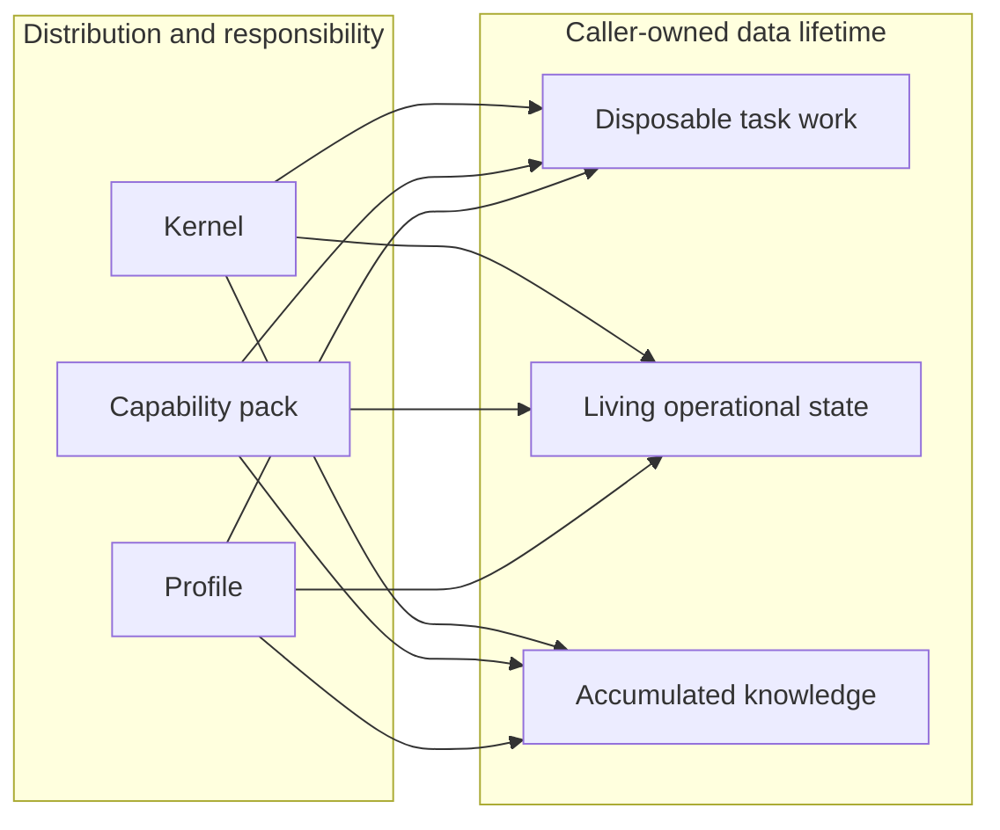
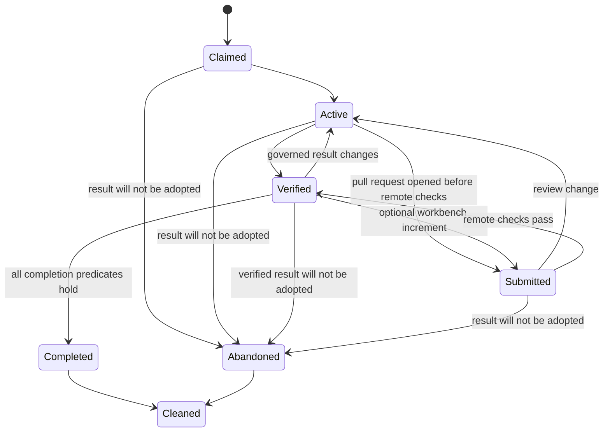
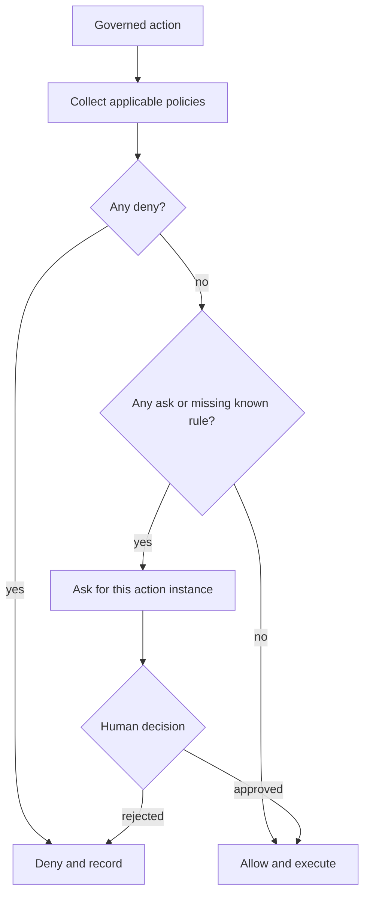
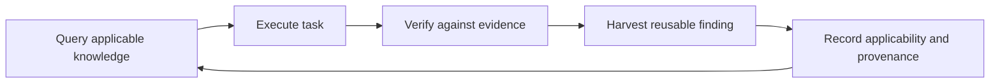
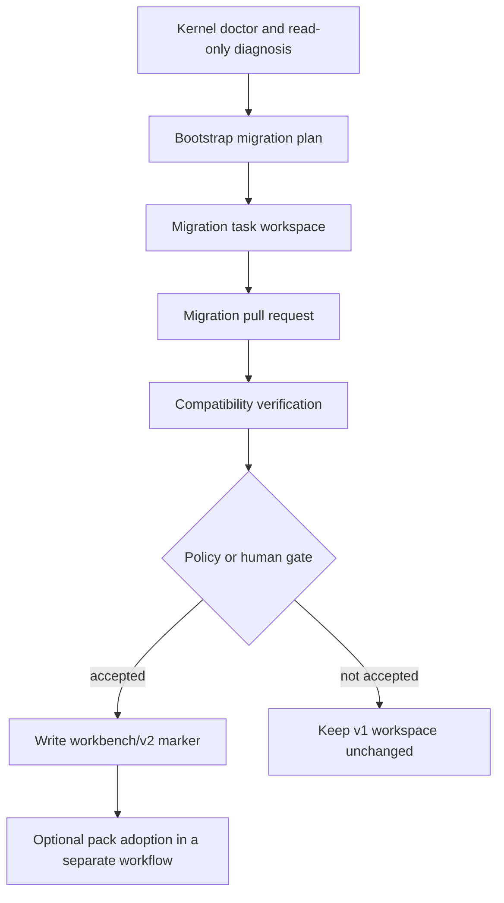

# Workbench v2 Governance Contract

Status: accepted design contract for workbench v2. Implementation is tracked by
[workbench-kit #26](https://github.com/YOOGOMJA/workbench-kit/issues/26) and migration by
[workbench-kit #27](https://github.com/YOOGOMJA/workbench-kit/issues/27). A consumer must
probe the running engine; this document alone does not imply that a capability is installed.

This document is normative for the public boundary shared by the workbench kernel,
bootstrap and migration tooling, and optional capability packs. Product, portfolio, and
scenario semantics remain outside the kernel.

## Design goals

1. Keep the generated workbench model: each issue executes in an isolated task workspace,
   durable results land in their owning repositories, selected knowledge is accumulated,
   and disposable task state is cleaned afterward.
2. Let one task deliver changes to zero or more codebases without requiring an empty
   workbench pull request.
3. Evaluate standing authorization deterministically without turning every gate into a
   prompt or removing the gate.
4. Give optional packs a stable public API and compatibility probe instead of prose parsing,
   internal imports, or implicit hooks.
5. Preserve v1 tasks and lifecycle observations while migration occurs incrementally.
6. Support compound engineering without mixing current product intent into reusable
   workbench knowledge.

## Canonical vocabulary

The following English identifiers are stable across tools and output languages.

| Term | Meaning |
|---|---|
| kernel | The generic `workbench` engine, public CLI, lifecycle, and invariants |
| capability pack | An optional plugin that composes public kernel contracts for a domain |
| profile | Caller-owned policy values, conventions, language, and document formats |
| task | One independently governed execution unit, rooted in one issue |
| deliverable | A declared result owned by a repository or another explicit target |
| evidence | A check result bound to an immutable revision |
| living state | Mutable intent that directs later work and survives task cleanup |
| knowledge | Reusable decisions, lessons, and runbooks accumulated across tasks |
| completion | Acceptance of every required outcome under current evidence and policy |
| abandonment | A terminal decision not to adopt the task's intended result |
| cleanup | Removal of task workspaces and local branches after a terminal outcome |

Translations may be shown to a person, but stored keys, schema IDs, lifecycle values,
capability IDs, and command names stay in English.

## Two independent axes

The v1 `framework / profile / knowledge` model mixed responsibility with data lifetime.
V2 makes those dimensions explicit and independent.



The responsibility axis answers who ships a rule and who interprets it. The lifetime axis
answers how caller-owned data evolves:

- **Disposable task work** includes plans, research, status, logs, temporary codebase
  worktrees, and execution evidence that is not itself a durable product artifact.
- **Living state** includes current intent, priorities, scenarios, quality constraints, and
  authorization scoped to a workspace or domain. It is edited over time, not harvested as
  an immutable lesson.
- **Accumulated knowledge** includes reusable decisions, failed approaches, and runbooks.
  It is queried by later tasks and is not a backlog or current product status store.

Plugin bundles contain executable framework content only. They never own caller runtime
state in any lifetime category.

## Task contract

### Identity and generic references

Existing task identity remains rooted in the issue and recorded in `task/index.md`.
Every new v2 task records `task_contract: workbench-task/v2` in that file. A missing field
means `workbench-task/v1` regardless of the enclosing workspace schema. This task-level
discriminator lets an active legacy task finish after its workbench migrates.

V2 adds two optional, opaque references:

- `context_ref`: the longer-lived context under which the task is governed.
- `work_ref`: the work item that the task advances.

The shared syntax is:

```text
<namespace>:<kind>/<id>
```

`namespace` and `kind` match `[a-z][a-z0-9-]*`. `id` is one or more ASCII letters,
digits, dots, underscores, or hyphens. Examples are `toolbox:product/acme` and
`toolbox:scenario/SCN-001`. The kernel validates syntax, stores the exact value, detects
duplicate active `work_ref` values, and reports the references. Only the namespace owner
interprets the value. Missing references have no product meaning and remain valid.

### Work-item and multi-context boundary

One task has one primary work item, represented by at most one `work_ref`, and zero or more
deliverables. The task owns one independent lifecycle, policy evaluation, verification set,
terminal outcome, and cleanup event. Workbench-wide or portfolio-wide state never replaces
these per-task facts.

Independent work in different products uses separate tasks even when one agent runs them in
the same session. One product work item may still produce several repository deliverables.
The kernel reports simultaneous `role: work` writers for the same codebase as
`writer_conflicts`, listing the owner, task claims, and branches. A report is an observation,
not a lock. Enforcement occurs at `task add-repo --role work`, before writer state or a
nested worktree is created. A conflict resolves `task.concurrent-write` over the union of
every writer's sealed context set and consumes authorization only after the writer claim
succeeds. Serialization uses the append-only `workbench-writer-claims/v1` ledger on fixed
canonical-origin ref `refs/heads/workbench-coordination/writer-claims`: each mutation creates
a commit whose parent is the observed remote OID and pushes by fast-forward or exact
force-with-lease CAS. A failed CAS refetches, recomputes conflicts/policy, and supersedes
stale authorization. The pushed commit OID is the serialization token, not a local lease.
Local-failure/crash retries reconcile the same persisted claim before creating another, and
a persisted claim that fresh policy no longer permits is released before the policy result
returns. Cleanup appends release rows without changing frozen task content. `workbench doctor`
checks canonical origin identity, ledger read/parse, and non-destructive push readiness; any
failure is `writer-lock-unavailable`.

A cross-product initiative normally uses an umbrella work item with independent child tasks.
Each child can verify, complete, abandon, and clean without pretending that every repository
merged atomically. A single atomic multi-context task is reserved for a result whose partial
adoption is invalid. It still has one primary `work_ref`; its singular `context_ref` points
to a pack-owned cross-context record that enumerates participants. All participating context
policies apply and the most restrictive result wins. Every atomic deliverable is required,
and the pack must define rollback because the kernel does not provide cross-repository
transactions.

The namespace owner registers the complete context-policy participant set through a strict
owner input. Every participant carries its own policy ref/digest and authenticated authority
receipt, so atomic work may preserve different owners instead of collapsing them into one
authority. An optional task policy is pinned and owner-authorized in the same set and may
only tighten. Registration requires explicit context-owner authorization; standing `allow`
is insufficient. A non-null context cannot seal an empty participant set. A null context
remains settable after task start; if still null at the first governed mutation or explicit
seal, it is lazily auto-registered/sealed with an empty set and no prompt. Context becomes
immutable only after seal. Every later governed mutation uses the whole set. Changed
participant/task bytes block as `policy-source-tampered`; callers cannot replace, omit, or
re-authorize them per action.

### Deliverables

A task declares zero or more deliverables. Each deliverable has, at minimum:

| Field | Contract |
|---|---|
| `deliverable_id` | Stable and unique within the task |
| `owner` | Registered repository or explicit owning target |
| `kind` | Kernel-defined kind or a namespaced pack kind |
| `required` | Boolean; defaults to `true` |
| `external_ref` | Optional pull request, artifact, or other delivery reference |
| `revision` | Exact revision identifier; required for `submitted`/`accepted`, optional otherwise |
| `state` | `declared`, `submitted`, `accepted`, `waived`, or `rejected` |
| `acceptance_ref` | Append-only authority receipt required for `accepted` |
| `governance_action` | Waive, reject, or weaken action ID; otherwise null |
| `reason_code`, `reason_ref` | Required stable reason and optional prose reference for a governed change |
| `governance_action_instance_id` | Consumed action for waiver, rejection, or weakening; otherwise null |
| `authorization_ref` | Matching authorization provenance, or null for standing allow |

The kernel understands the mechanics of its own kinds, such as a codebase pull request or
a workbench increment. It does not infer product semantics from a deliverable. A required
deliverable can be `waived` only through a governed action with a recorded reason. An open
or unmerged pull request is `submitted`, not `accepted`. A task with no workbench increment
must not create an empty workbench pull request merely to reach completion.

`submitted` and `accepted` require a non-null revision; `declared`, `waived`, and `rejected`
may remain null. One update can weaken, waive, or reject, never combine those governed
effects, and must persist its reason and one action/authorization binding. A later explicit
reset to `declared`/`submitted` clears current governance/acceptance fields but retains
append-only receipts; a changed revision makes prior evidence stale. Required checks are
declared independently from evidence, so completion distinguishes "no check was required"
from "required evidence is missing". Exact commands and reset rules are in
[[workbench-v2-cli-contract]].

No caller can set `accepted` directly. Kernel-owned pull-request kinds require a deterministic
merged-PR probe whose repository and head revision match. Pack-owned kinds require a strict
owner assertion plus explicit `task.deliverable.accept` authorization. The kind namespace
and assertion authority ref must resolve exactly one sealed participant; its independent
receipt authenticates the actor. Standing `allow` alone is insufficient.
Both paths create `workbench-acceptance/v1` receipts included in the task content revision.

### Verification evidence

Evidence is an observation, not a claim inferred from prose. The public
`workbench-evidence/v1` record uses these fields:

| Field | Contract |
|---|---|
| `evidence_id` | Stable and unique within the task |
| `owner` | Registered repository or explicit target |
| `subject_ref` | Exact deliverable or task subject checked |
| `subject_revision` | Immutable deliverable revision or task-content digest checked |
| `check_id` | Stable identifier for the required check |
| `command` | Optional exact local command |
| `result` | `passed` or `failed` |
| `recorded_at` | RFC 3339 timestamp |
| `source` | `local` or `ci` |
| `url` | Optional independently inspectable remote evidence |

Evidence owner and subject must exactly match its required-check record. Deliverable checks
bind to the deliverable revision; task-level checks bind to the evidence-free
`workbench-task-content/v1` digest. A new revision or content digest makes older evidence
stale without creating a self-referential hash. A summary such as "tests passed" without
the exact subject revision cannot satisfy completion.

### Lifecycle facts

Lifecycle comments remain append-only, centrally observable facts. They are neither locks
nor the sole source of truth. Current state is derived by joining task metadata, branches,
deliverables, pull requests, evidence, policies, issue state, and lifecycle observations.



The exact event IDs are `task-claimed`, `task-claim-conflict`, `task-active`,
`task-verified`, `task-submitted`, `task-completed`, `task-abandoned`, and `task-cleaned`.
A writer correlates them with `claim_id` and branch.

The canonical v2 marker is UTF-8 JSON inside a versioned HTML comment:

```html
<!-- workbench-task-lifecycle:v2
{"task_contract":"workbench-task/v2","event":"task-completed","claim_id":"task__example__42-20260711T030000Z-1234","issue":42,"home":null,"branch":"task/42-example","pr":null,"revision":"sha256:0123456789abcdef0123456789abcdef0123456789abcdef0123456789abcdef","action_instance_id":"act_01J00000000000000000000000","actor":"human@example.com","tool":"workbench","at":"2026-07-11T03:02:00Z"}
-->
```

The opening line, one minified JSON line, and closing line are exact. Keys are serialized in
the shown order. Strings use RFC 8259 escaping. Missing `home`, `pr`, `revision`, and
`action_instance_id` values are JSON `null`, never `-`, an empty string, or an omitted key.
`issue` and `pr` are JSON integers when present; `at` is RFC 3339 UTC. `task-verified`
requires the verified `workbench-task-revision/v1` digest. Completion and abandonment
require both revision and action instance. A human-readable comment line may follow the
marker but is not part of the contract.

| Event | `pr` | `revision` | `action_instance_id` |
|---|---|---|---|
| `task-claimed`, `task-claim-conflict`, `task-active` | null | null | null |
| `task-verified` | null | required | null |
| `task-submitted` | required | required | null |
| `task-completed`, `task-abandoned` | null or related workbench PR | required | required |
| `task-cleaned` | null | terminal revision | cleanup action instance |

V1 key/value markers remain readable and are never rewritten. Detailed deliverable,
evidence, and policy facts remain available through public CLI records instead of being
duplicated into the comment. Marker details remain machine facts; issue disposition, labels,
and explanatory prose remain outside the marker.

The meanings are distinct:

- `task-verified` says the required checks passed for named revisions at that time. It can
  become stale and the task can return to active work.
- `task-submitted` says a workbench increment pull request exists. It is optional and is not
  completion.
- `task-completed` is a terminal adoption outcome. Later external rollback is a new fact or
  task; history is not rewritten.
- `task-abandoned` is a terminal non-adoption outcome. It is not completion or failure
  disguised as cleanup.
- `task-cleaned` says local task resources were removed after a terminal outcome. It says
  nothing about whether the outcome was completion or abandonment.

### Completion predicate

A v2 task is complete only when all applicable conditions hold:

1. Every required deliverable is `accepted` or has a policy-authorized `waived` outcome.
2. Every required verification check has passing, current evidence for its exact
   deliverable-revision or task-content subject. No failed required check remains current.
3. A declared codebase pull request is merged or otherwise accepted by its owning target;
   merely opening the pull request is insufficient.
4. If the task contains a workbench increment, its normal submit and acceptance path is
   satisfied. If it contains none, no workbench pull request is required.
5. The `workbench-harvest/v1` inventory is sealed and every candidate has a recorded
   disposition. A sealed empty inventory explicitly means no candidates. Product-specific
   current state is not mislabeled as workbench knowledge to satisfy this condition.
6. No applicable policy resolves to `deny`, and no required action remains unresolved at
   `ask`.

Abandonment is a different terminal predicate. It requires a non-terminal task, a parseable
current revision snapshot, sealed context policy, a reason code, and authorized
`task.abandon`. It deliberately does not require accepted deliverables, passing evidence,
or harvest disposition; claiming those would misstate non-adoption as completion.

Cleanup is never a completion predicate. Destructive cleanup before completion or
abandonment is invalid for v2 tasks. Existing v1 force-cleanup behavior remains a legacy
compatibility path until migration policy removes it in a future major contract. V2 cleanup
is the governed `task.cleanup` action and has its own revision-bound receipt, blockers, and
retry semantics in [[workbench-v2-cli-contract]]. Before deleting task-local recovery state,
it persists a `prepared` cleanup journal in the task home's issue comments; retries reconcile
that external receipt through writer-claim release, `completed`, and `task-cleaned`. Release
appends a CAS ledger event on the canonical coordination ref and does not mutate frozen task
content.

Completion and abandonment both freeze every revision-affecting fact. Refs, context set,
deliverables and acceptance, required checks, evidence, harvest, and writer claims reject
mutation with `terminal-content-frozen`. Only read-only queries, same-outcome reconciliation,
durable cleanup-journal reconciliation, and bookkeeping excluded from the content revision
remain available. Coordination-ledger release is cleanup bookkeeping, not a task-content
change. Result changes require a new task.

## Policy contract

Every externally consequential or irreversible action has a stable action ID and must be
resolved before execution. The canonical decisions are:

| Decision | Meaning |
|---|---|
| `allow` | Standing authorization permits this action instance |
| `ask` | Explicit human authorization is required before execution |
| `deny` | Execution is prohibited; the agent must find a non-prohibited alternative or stop |

Policy resolution uses the safety lattice `deny > ask > allow`. Applicable layers are
evaluated in this order of authority:

1. platform and harness safety policy;
2. workspace policy;
3. every sealed referenced-context policy;
4. an optional sealed task policy.

A lower-authority layer may tighten but never relax a higher-authority result. Workspace
policy is required. Absent optional platform/task policy is neutral and contributes no row;
a valid present source missing a known action contributes `ask`. The v1 executable registry
is exactly the frozen kernel action table in [[workbench-v2-cli-contract]]. Unknown or
namespaced action IDs are `unsupported-action`, not executable `ask`; pack action
registration is reserved for a future contract. An agent must not infer authorization from
previous similar actions, prose, silence, or a successful dry run.



Human approval resolves that action instance; it does not silently rewrite standing
policy. Policy evaluation records the action ID, applicable policy sources, result, and
authorization reference without asking shell plumbing to invent explanatory prose.

V2 bootstrap/task claim pins canonical workspace origin URL, authority identity, and default
ref in an authenticated `workbench-workspace-authority/v1` issue fact outside the task
branch. Bootstrap uses `task_claim_id: null`; each task claim copies the same identity with
its claim ID, and the two must match. Remote unavailability is
`policy-authority-unavailable`; changed identity/ref is
`policy-authority-mismatch`; a valid current authority revision missing required workspace
policy is `policy-source-missing`.

The kernel mints a unique action instance bound to `action_id`, `task_claim_id`,
`target_ref`, revision digest, and the full canonical policy-source manifest. An
authorization repeats the manifest digest with every other binding field. The sealed task
context-policy set makes participant omission impossible for a direct caller. Immediately
before consumption, the kernel re-observes the pinned workspace origin/default ref with
`ls-remote --symref`, fetches its current OID, reads only that immutable object's
`.workbench/policy.conf`, validates every sealed participant/task receipt and digest, and
re-resolves strictest policy. The task-branch workspace copy is ignored. A changed protected
workspace revision supersedes old authorization; changed sealed context/task bytes fail as
`policy-source-tampered` without a replacement. These rules prevent approval for one task,
target, revision, policy set, or authority revision from authorizing another. The trusted
platform remains responsible for authenticating approving actors and authority receipts.

The public `workbench-policy/v1` resolution object is:

```json
{
  "contract_version": "workbench-policy/v1",
  "action_instance": {
    "id": "act_01J00000000000000000000000",
    "action_id": "task.complete",
    "task_claim_id": "task__example__42-20260711T030000Z-1234",
    "target_ref": "toolbox:scenario/SCN-001",
    "revision": "sha256:0123456789abcdef0123456789abcdef0123456789abcdef0123456789abcdef",
    "policy_manifest": {
      "contract_version": "workbench-policy-manifest/v1",
      "digest": "sha256:4444444444444444444444444444444444444444444444444444444444444444",
      "sources": [
        {
          "layer": "workspace",
          "context_ref": null,
          "policy_ref": ".workbench/policy.conf",
          "policy_digest": "sha256:1111111111111111111111111111111111111111111111111111111111111111",
          "authority_identity": "github:example/workbench",
          "authority_ref": "refs/heads/main",
          "authority_revision": "1111111111111111111111111111111111111111",
          "authority_receipt_digest": "sha256:cccccccccccccccccccccccccccccccccccccccccccccccccccccccccccccccc",
          "decision": "ask"
        }
      ]
    },
    "status": "pending"
  },
  "decision": "ask",
  "authorization_ref": null
}
```

`policy_manifest.sources[].layer` is one of `platform`, `workspace`, `context`, or `task`.
Each present row binds policy ref/digest plus authority identity/ref/revision/receipt digest;
there are no null placeholders for absent optional sources. Context rows also keep their
context ref. `authorization_ref` is null until an explicit matching authorization is
recorded. Exact authority facts, registration, manifest serialization, blockers, binding,
and re-resolution rules are in [[workbench-v2-cli-contract]].

## Public capability discovery

Capability packs must not parse `AGENTS.md`, inspect plugin internals, or guess compatibility
from a package version. They call this read-only command before mutation:

```text
workbench contract show --format json
```

Stdout is exactly one JSON document with `contract_version` equal to
`workbench-contract/v1`. Diagnostics go to stderr. Running outside a workbench, reading an
invalid schema marker, or requesting an unsupported format exits nonzero and emits no
partial JSON.

The canonical v1 shape is:

```json
{
  "contract_version": "workbench-contract/v1",
  "engine": {
    "name": "workbench",
    "version": "0.2.0"
  },
  "workspace": {
    "root": "/absolute/caller/workbench",
    "schema": "workbench/v2",
    "source": "marker"
  },
  "profile": {
    "contract_version": "workbench-profile/v1",
    "language": "ko",
    "source": "workspace"
  },
  "supported": {
    "workspace_schemas": {
      "read": ["workbench/v1", "workbench/v2"],
      "write": ["workbench/v2"]
    },
    "task_contracts": {
      "read": ["workbench-task/v1", "workbench-task/v2"],
      "write": ["workbench-task/v2"]
    },
    "lifecycle_markers": {
      "read": ["workbench-task-lifecycle:v1", "workbench-task-lifecycle:v2"],
      "write": ["workbench-task-lifecycle:v2"]
    },
    "profile_contracts": ["workbench-profile/v1"],
    "workspace_authority_contracts": ["workbench-workspace-authority/v1"],
    "policy_contracts": ["workbench-policy/v1"],
    "policy_manifest_contracts": ["workbench-policy-manifest/v1"],
    "policy_authority_receipt_contracts": ["workbench-policy-authority-receipt/v1"],
    "context_policy_contracts": ["workbench-context-policy-registration/v1", "workbench-context-policy-set/v1"],
    "authorization_contracts": ["workbench-authorization/v1"],
    "acceptance_contracts": [
      "workbench-acceptance/v1",
      "workbench-acceptances/v1",
      "workbench-deliverable-acceptance/v1",
      "workbench-owner-acceptance/v1"
    ],
    "external_probe_contracts": ["workbench-probe/github-pr/v1"],
    "cleanup_journal_contracts": ["workbench-task-cleanup-journal/v1"],
    "doctor_contracts": ["workbench-doctor/v1"],
    "evidence_contracts": ["workbench-evidence/v1"],
    "writer_claim_contracts": ["workbench-writer-claim/v1", "workbench-writer-claims/v1"],
    "capability_pack_contracts": ["workbench-capability-pack/v1"],
    "action_ids": [
      "task.abandon",
      "task.cleanup",
      "task.complete",
      "task.concurrent-write",
      "task.deliverable.accept",
      "task.deliverable.reject",
      "task.deliverable.waive",
      "task.deliverable.weaken",
      "task.harvest.dispose",
      "task.policy-context.register",
      "task.policy-context.seal",
      "task.required-check.waive"
    ]
  },
  "capabilities": [
    "knowledge.applicability/v1",
    "policy.authority/v1",
    "policy.authorization/v1",
    "policy.context-set/v1",
    "policy.resolve/v1",
    "profile.language/v1",
    "task.acceptance/v1",
    "task.cleanup/v1",
    "task.completion/v1",
    "task.contract/v2",
    "task.deliverables/v1",
    "task.evidence/v1",
    "task.harvest/v1",
    "task.lifecycle/v2",
    "task.refs/v1",
    "task.required-checks/v1",
    "task.writer-claims/v1",
    "task.writer-conflicts/v1",
    "workspace.authority/v1",
    "workspace.doctor/v1",
    "workspace.schema/v1"
  ]
}
```

`workspace.root` is the absolute caller workbench root. `workspace.source` is `marker` when
the tracked `.workbench/schema` file exists and `implicit` when its absence maps to legacy
`workbench/v1`. The marker contains exactly one schema ID line; a new v2 workbench writes:

```text
workbench/v2
```

Supported arrays are sets. Consumers must not depend on member or array order and must
ignore unknown object fields and capability IDs. They must require every capability they
use and reject an unavailable contract before mutation. A producer may add optional fields
or capability IDs within `workbench-contract/v1`; changing or removing defined field
semantics requires a new discovery contract version.

`supported.action_ids` is different: it is the complete executable v1 registry, not an open
extension point. An action absent from that array cannot be resolved or executed. Runtime
writer-ref readiness is reported by `workbench doctor`; advertising the capability does not
turn an unreadable or unwritable coordination ref into authority.

Only workspace schemas listed under `supported.workspace_schemas.write` may receive v2
mutations without migration. A v2 engine can read an implicit v1 workspace and run legacy
flows, but a capability pack requiring v2 state must stop with an actionable migration
message.

`profile` is the same public object returned by `workbench profile show --format json`.
V2 requires a valid tracked `.workbench/profile.conf`. If it is missing, unreadable, or
invalid, discovery fails closed and emits no partial contract; it never advertises
`profile.language/v1` with `language: null`. Only an implicit v1 workspace without a machine
profile reports `language: null` and `source: "unavailable"`. The engine does not parse
`AGENTS.md`. The exact file grammar and CLI behavior are in [[workbench-v2-cli-contract]].

## Capability-pack contract

The public pack contract ID is `workbench-capability-pack/v1`. A conforming pack:

1. calls only documented `workbench` CLI contracts for generic lifecycle state;
2. checks `workbench contract show --format json` and all required capability IDs before
   mutation;
3. stores runtime state in the caller workbench or an explicitly owning codebase, never in
   the installed plugin bundle;
4. owns domain validation for its namespaced references and state, while the kernel remains
   domain-neutral;
5. uses explicit skill orchestration instead of implicit lifecycle hooks;
6. does not source private engine shell files, import undocumented internals, patch generated
   core files, or infer facts from narrative documents;
7. reads `profile.language/v1` and emits reader-facing prose in that language while
   preserving canonical English identifiers; if language is unavailable, it asks or uses an
   explicitly pack-owned default and never parses `AGENTS.md`;
8. leaves the generated workbench empty of pack state until the user invokes the pack's
   initialization workflow.

A pack may ship its own deterministic CLI and schemas. Those schemas are independently
versioned and declare their required workbench capabilities; plugin SemVer alone is not a
state-schema version. In v1 a pack cannot register or execute a new governed action ID; it
composes the frozen kernel registry. Toolbox product semantics therefore use generic refs,
deliverables, required checks, evidence, harvest, completion/abandonment, concurrency, and
cleanup rather than a parallel policy action namespace. Public pack-action registration is
reserved for a future contract version.

## Compound knowledge contract

The compound loop is:



Knowledge is promoted by reuse value, not by volume. The following ownership rules apply:

| Finding | Durable owner |
|---|---|
| Task-only exploration, status, or implementation plan | None; removed at cleanup |
| Current product intent, scenario, or design state | Owning codebase or pack living state |
| Product-specific architecture or operating rule | Owning codebase |
| Cross-task decision, failed approach, or runbook | Workbench `docs/` |
| Framework behavior useful to every installation | A workbench-kit change candidate |

Each task maintains a `workbench-harvest/v1` ledger. Skills declare candidates and their
judgment-driven dispositions; plumbing stores facts without inventing prose. The inventory
must be sealed, including an explicitly empty inventory, and every candidate disposed before
completion. Exact commands and disposition records are in [[workbench-v2-cli-contract]].

A reusable finding records enough context to avoid unsafe cargo-cult reuse: scope,
applicability, known exclusions, provenance to task and delivered revision, last verification,
and confidence. A first observation is `provisional`; independent successful reuse may make
it `confirmed`. Confidence never broadens scope or overrides an exclusion. The kernel may
transport these facts, but agents decide whether a finding is reusable and whether new
evidence changes its applicability.

The optional machine mapping is `workbench-knowledge-applicability/v1`, embedded after the
existing entry template fields so decisions, lessons, and runbooks keep their current
human-readable shape:

```html
<!-- workbench-knowledge-applicability:v1
{"contract_version":"workbench-knowledge-applicability/v1","scope":{"kind":"context","ref":"toolbox:product/acme"},"applies_when":["OIDC browser sign-in"],"does_not_apply_when":["machine-to-machine credentials"],"evidence":[{"task_ref":"workbench:task/task__acme__42","deliverable_ref":"toolbox:deliverable/auth-pr","revision":"0123456789abcdef"}],"last_verified":"2026-07-11T03:00:00Z","confidence":"provisional"}
-->
```

`scope.kind` is `workspace`, `context`, or `codebase`; `scope.ref` is null only for workspace
scope. Conditions are arrays of concise prose in the caller's profile language. Evidence
contains exact task, deliverable, and immutable revision references. `last_verified` is RFC
3339 or null. `confidence` is `provisional` or `confirmed`.

The existing template `Source` field remains the human-readable provenance summary and
`Relations` remains the typed-edge surface. The embedded record is additional structured
applicability, not a replacement. Absence means applicability is unspecified, not universal.
Existing entries need no bulk migration; Query treats them conservatively until a later task
adds evidence.

## Backward compatibility

Workbench v2 follows these rules:

- The engine reads v1 `task/index.md` files without `context_ref`, `work_ref`, deliverables,
  or evidence. Missing `task_contract` means `workbench-task/v1`, even inside a v2 workspace;
  missing other fields mean unknown or undeclared, never implicitly satisfied.
- The engine reads `workbench-task-lifecycle:v1` observations and does not rewrite them.
- Active v1 tasks may resume, submit, and clean using v1 behavior. They are not forced to
  convert mid-task.
- New v2 events are written only where the workspace schema and engine capabilities allow
  them and the task declares `workbench-task/v2`. V1-only readers may ignore unknown v2
  observations.
- V2 governed mutations require an authenticated workspace-authority claim fact and current
  required policy on its pinned default ref. There is no fallback to a task worktree copy.
- Adding an optional discovery field or a new capability is backward compatible. Removing
  a field, changing defined semantics, or making optional state mandatory requires a new
  contract or workspace schema version.
- Plugin releases use SemVer, while workspace, lifecycle, policy, evidence, pack, and
  domain-state schemas retain their independent version IDs.

## Migration ownership

Migration remains an ordinary governed task, not an in-place bootstrap side effect.



- The **kernel** detects the caller schema, exposes compatibility facts, reads supported v1
  state, and refuses unsafe writes.
- **workbench-kit bootstrap/migration** diagnoses generated-minimal and embedded-legacy
  workbenches, preserves user overlays and accumulated knowledge, and writes the schema
  marker, valid `.workbench/profile.conf`, and required `.workbench/policy.conf` in the same
  accepted migration pull request. It pins canonical origin/default-ref identity through the
  trusted bootstrap/claim adapter and requires doctor to prove authority readability and
  non-destructive coordination-ref write readiness. Profile and policy must be valid on the
  protected default branch before the v2 marker is exposed. Migration does not add
  `task_contract` to active legacy tasks; only newly created v2 tasks receive it.
- A **capability pack** adopts or migrates only its own domain state after the generic
  workbench contract is compatible. Installing a pack never implies adoption.
- The **user or resolved policy** controls merge, destructive cleanup, production effects,
  and other governed actions.

Migration must be idempotent. Re-running diagnosis against an already-current workspace
reports no required mutation. Removing v1 read compatibility requires a future major
contract and an explicit deprecation window.

## AI-oriented constraints

The contract is optimized for reliable agent operation without making human review opaque:

- machine consumers receive versioned structured facts; people receive rationale and
  diagrams;
- unknown values fail closed and unknown action IDs are non-executable, so a model cannot
  turn uncertainty into authorization;
- workspace policy comes from a pinned remote authority object, never a task-editable copy;
- evidence is revision-bound, so stale success language cannot satisfy completion;
- stable English identifiers avoid translation drift across Claude Code, Codex, and future
  adapters;
- domain-neutral refs let packs compose the kernel without teaching core product concepts;
- rejected alternatives are retained so later agents do not recreate parallel lifecycles or
  put runtime state in plugin bundles.

## Decision lineage

This contract:

- extends [[0015-task-lifecycle-events]] by adding v2 observations while preserving the
  machine-fact boundary;
- extends [[0016-mechanical-invariant-enforcement]] by placing policy, deliverable,
  evidence, compatibility, and completion facts behind public CLI plumbing;
- supersedes the single-axis interpretation in [[0018-separation-architecture]],
  while preserving its valid ownership distinction as the responsibility axis;
- preserves the distribution, empty-start, persona-boundary, cross-tool, and language
  decisions in historical workbench ADRs
  [0019](https://github.com/YOOGOMJA/workbench/blob/main/docs/decisions/0019-framework-distribution-cli-first.md),
  [0020](https://github.com/YOOGOMJA/workbench/blob/main/docs/decisions/0020-user-docs-empty-start.md),
  [0021](https://github.com/YOOGOMJA/workbench/blob/main/docs/decisions/0021-persona-framework-rule-boundary.md),
  [0022](https://github.com/YOOGOMJA/workbench/blob/main/docs/decisions/0022-cross-tool-claude-codex-distribution.md),
  and
  [0023](https://github.com/YOOGOMJA/workbench/blob/main/docs/decisions/0023-kit-english-persona-language.md).

The architectural choice and rejected alternatives are recorded in
[[0024-workbench-v2-governance]]. Exact commands, record schemas, and exit behavior are in
[[workbench-v2-cli-contract]].
